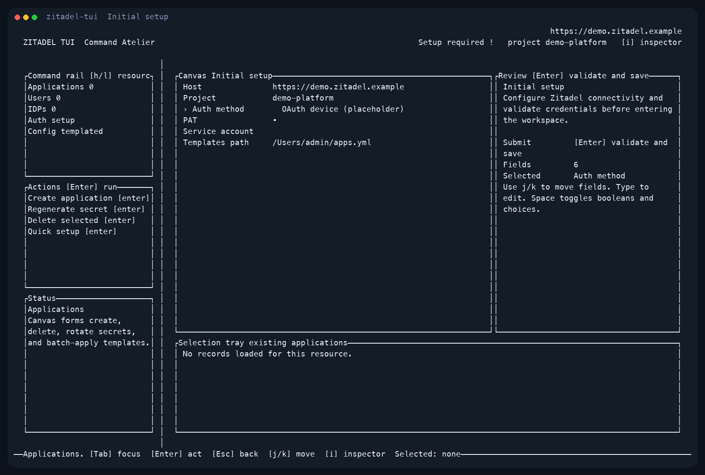
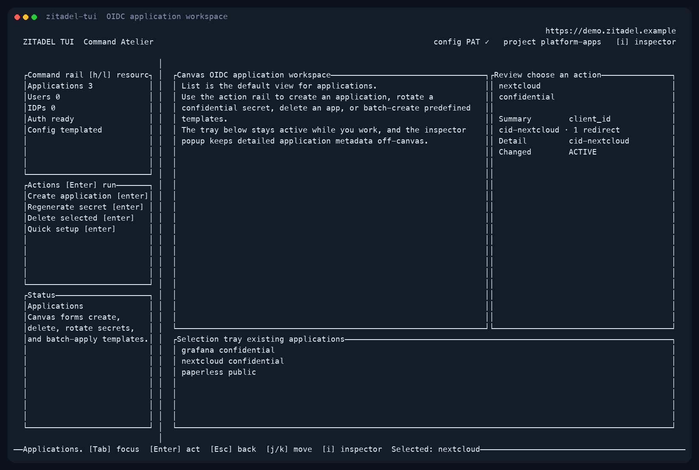
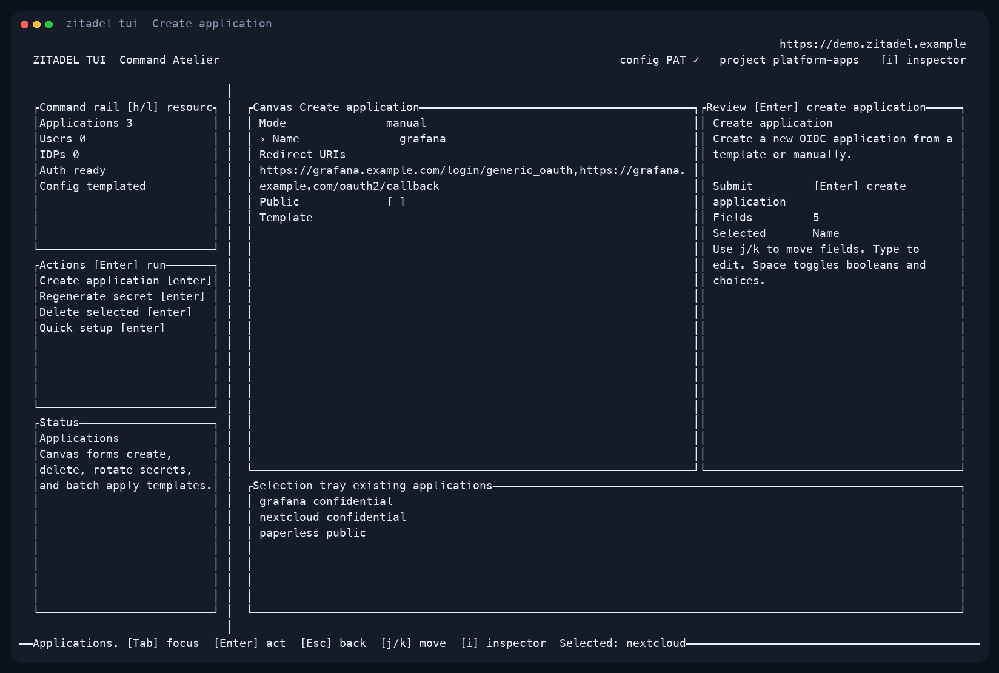

# Manage OIDC Applications

This guide is for Zitadel administrators who need to add, remove, or maintain
OIDC applications in `zitadel-tui`.



## Before you start

You need:

- a Zitadel host URL
- either a PAT, a service-account JSON file, or a working device-flow login
- an optional `apps.yml` if you want template-based quick setup

Why this can feel harder than it should:

- there are three authentication paths: PAT, service account, and device flow
- the TUI setup screen still labels OAuth device as a placeholder, so the login
  journey is not fully explained in-canvas
- device-flow login is CLI-only and requires a native app that already has
  Device Code enabled and JWT access tokens configured
- application settings are not editable in place today; if redirect URIs or the
  client type change, the current workflow is to recreate the app

## Use the TUI

Once authenticated, open the application workspace. The action rail is where
you create apps, rotate secrets, delete apps, or run quick setup from templates.



For a manual app:

1. Open `Applications`.
2. Choose `Create application`.
3. Enter the app name and a comma-separated redirect URI list.
4. Leave `Public` off for confidential clients, or toggle it on for public
   clients.
5. Submit the form.



For ongoing maintenance:

- use `Regenerate secret` for confidential clients
- use `Delete selected` when an app should be removed entirely
- recreate the app if you need to change redirect URIs or switch between public
  and confidential
- use `Quick setup` when the app already exists in `apps.yml`

## Use the CLI

List apps:

```bash
zitadel-tui apps list
```

Create a Grafana app manually:

```bash
zitadel-tui apps create \
  --name grafana \
  --redirect-uris https://grafana.example.com/login/generic_oauth,https://grafana.example.com/oauth2/callback
```

Create a native app for device-flow login:

```bash
zitadel-tui apps create-native --name zitadel-tui --device-code
```

Delete an app:

```bash
zitadel-tui apps delete --app-id 123456789012345678
```

Rotate a confidential client secret:

```bash
zitadel-tui apps regenerate-secret --app-id 123456789012345678
```

Quick setup from templates:

```yaml
apps:
  grafana:
    redirect_uris:
      - https://grafana.example.com/oauth2/callback
      - https://grafana.example.com/login/generic_oauth
    public: false

  paperless:
    redirect_uris:
      - https://paperless.example.com/oauth2/callback
      - https://paperless.example.com/accounts/oidc/zitadel/login/callback/
    public: false

  nextcloud:
    redirect_uris:
      - https://nextcloud.example.com/apps/oidc_login/oidc
    public: false
```

Then run:

```bash
zitadel-tui apps quick-setup --names grafana,paperless,nextcloud
```

## If authentication is the blocker

For the smoothest path today:

1. Use a PAT if you already have one.
2. Use a service-account file if this is automation or shared admin tooling.
3. Use device flow only after creating a native app with `--device-code`, then
   run `zitadel-tui auth login --client-id <CLIENT_ID>`.

If `auth login` succeeds in the browser but still fails in the CLI, the usual
cause is that the native app is returning an access token format the Zitadel
management APIs cannot use. In this project, that means the native app needs
Device Code enabled and JWT access tokens, not an opaque token.
